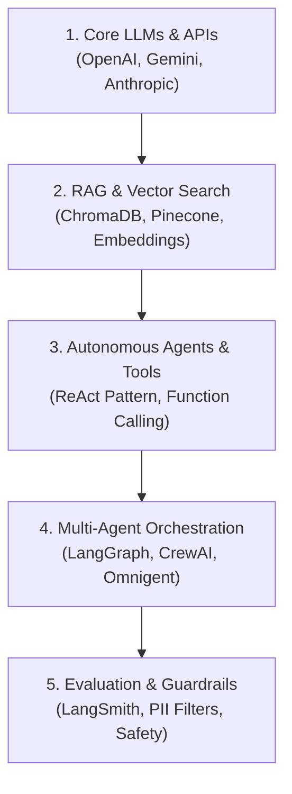

# 🤖 The AI Apprentice

<p align="center">
  
  
  
  
</p>

> **Master AI Engineering, Autonomous Agent Workflows, RAG Architecture, and Production LLM Systems.**

---

## 🌟 Overview

**The AI Apprentice** is a hands-on repository dedicated to building, benchmarking, and mastering state-of-the-art Artificial Intelligence engineering patterns. From core LLM API integrations and Retrieval-Augmented Generation (RAG) pipelines to multi-agent swarm orchestrations and autonomous tool usage, this project serves as a comprehensive lab for modern AI development.

---

## 🗺️ Learning Roadmap & Curriculum Modules



### 📚 Curriculum Breakdown

1. **Module 01: Core LLM Foundations & Prompt Engineering**
   - API Client Wrappers for OpenAI, Google Gemini, Anthropic Claude, and DeepSeek.
   - Structured Output Generation with Pydantic and JSON Schema validation.
   - Streaming responses, token optimization, and temperature controls.

2. **Module 02: Advanced Retrieval-Augmented Generation (RAG)**
   - Document Parsing & Hybrid Chunking strategies.
   - Vector Databases: Local ChromaDB, FAISS, and cloud vector indexers.
   - Re-ranking, Context Compression, and Multi-Query Retrieval methods.

3. **Module 03: Autonomous Tool-Using Agents**
   - ReAct (Reasoning + Acting) loop implementations.
   - Custom Tool bindings (Web Search, Code Execution, SQL Databases, Calculator).
   - Dynamic Memory & Conversation Context Management.

4. **Module 04: Multi-Agent Systems & Swarm Workflows**
   - Specialist agent team topologies and role definitions.
   - Handoff mechanics, state graphs, and supervisor agent patterns using LangGraph.
   - Human-in-the-Loop approval gates and policy enforcement.

5. **Module 05: Production AI, Guardrails & Evaluation**
   - LLM Output Safety Filtering, PII Redaction, and AMES/hERG style guardrails.
   - Latency & Cost benchmarking analytics.
   - FastAPI & Streamlit interactive web user interfaces.

---

## 🛠️ Project Structure

```
The-AI-Apprentice/
├── README.md                   # Repository Documentation & Learning Guide
├── requirements.txt            # Project dependencies
├── .gitignore                  # Git ignore rules
├── 01_foundations/             # Core LLM API wrappers & prompt templates
│   ├── llm_clients.py
│   └── structured_output.py
├── 02_rag_pipeline/            # Retrieval Augmented Generation scripts
│   ├── vector_store.py
│   └── rag_engine.py
├── 03_agents/                  # ReAct & Tool-Using Autonomous Agents
│   ├── tools.py
│   └── agent_loop.py
├── 04_multi_agent_swarms/      # LangGraph / Omnigent Multi-Agent Orchestration
│   ├── supervisor.py
│   └── specialist_agents.py
└── 05_app/                     # Interactive Streamlit Web Application
    └── app.py
```

---

## ⚡ Quickstart Guide

### 1. Prerequisites
Ensure you have **Python 3.10+** installed on your system.

### 2. Clone & Set Up Environment

```bash
git clone https://github.com/MalikZeeshan1122/The-AI-Apprentice.git
cd The-AI-Apprentice
python -m venv venv
# On Windows:
venv\Scripts\activate
# On Linux/macOS:
source venv/bin/activate
```

### 3. Install Dependencies

```bash
pip install -r requirements.txt
```

### 4. Configure Environment Keys
Create a `.env` file in the root directory:

```env
OPENAI_API_KEY=your_openai_key_here
GEMINI_API_KEY=your_gemini_key_here
ANTHROPIC_API_KEY=your_anthropic_key_here
```

---

## 📜 License

Distributed under the **MIT License**. See `LICENSE` for more information.

---

*Maintained by [MalikZeeshan1122](https://github.com/MalikZeeshan1122)*
