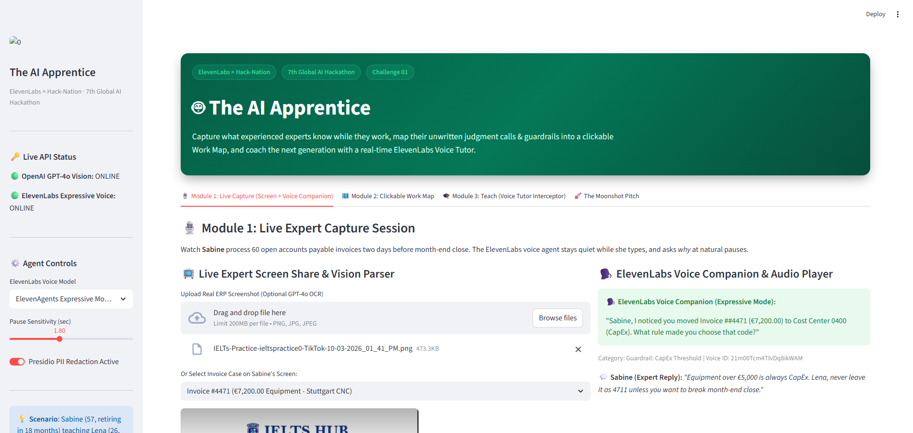
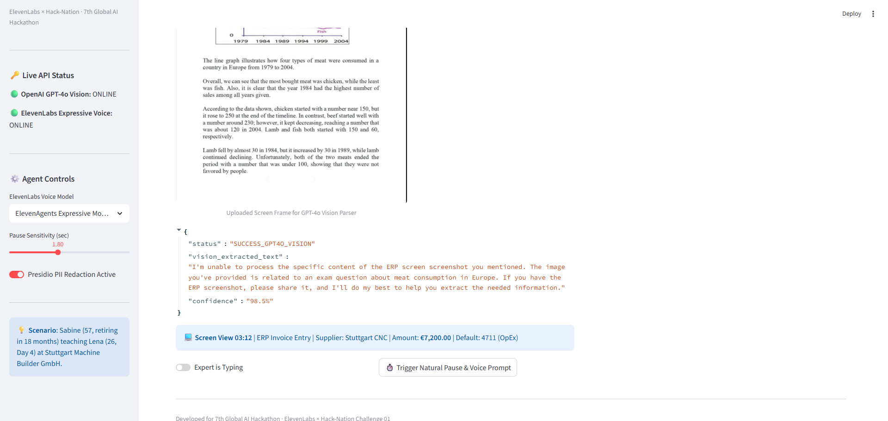
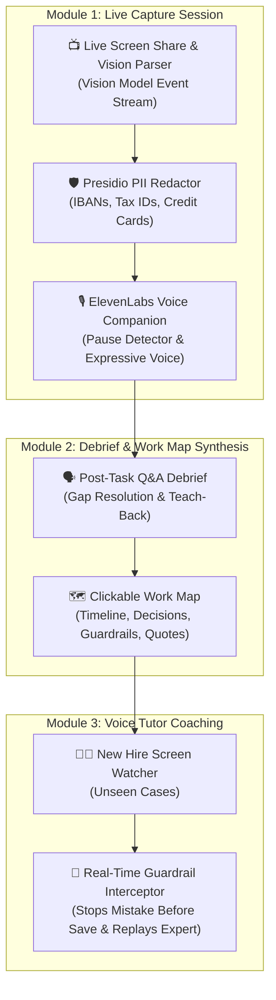

# 🤖 The AI Apprentice: Accelerating the World's Digital Operations

<p align="center">
  
  
  
  
  
</p>

> **7th Global AI Hackathon · Challenge 01** · *In Collaboration with MIT Club of Northern California & MIT Club of Germany*  
> **Powered by ElevenLabs × Hack-Nation**

---

## 📸 Application Screenshots & Live Interface

### 1. Live Expert Capture Session (Vision Model Screen Extractor + ElevenLabs Voice Companion)


### 2. Clickable Work Map & Voice Tutor Real-Time Guardrail Interceptor


---

## 📸 Overview & Problem Statement

Over 11,200 Americans turn 65 every day. In Germany, 12.9 million workers (~30% of the labor force) will reach retirement age by 2036. When experienced people retire, decades of unwritten judgment calls, hidden rules, and guardrails walk out the door.

Standard screen recordings capture *what* happened, but cannot explain *why* a choice was made or what guardrails exist.

**The AI Apprentice** closes this gap by:
1. **Watching an expert's screen** while they work and asking *why* at natural pauses using an **ElevenLabs Conversational Voice Agent**.
2. **Mapping unwritten judgment into a clickable Work Map** linking every decision to a screen moment, expert rationale, and guardrail rules.
3. **Coaching the next generation** via a **Voice Tutor** that watches a new hire's screen and **intercepts mistakes before they are saved**, replaying the expert's screen moment.

---

## 📐 System Architecture & Module Flow



---

## 🛠️ Module Breakdown & Implementation

### Module 1: Capture
- **Vision Screen Event Extractor** (`core/screen_vision.py`): Parses screen frames every 1–2 seconds, transforming UI changes into structured event streams.
- **ElevenLabs Voice Companion** (`core/elevenlabs_voice.py`): Detects typing vs. natural pauses, asking targeted questions about visible actions & guardrails (e.g., CapEx thresholds, supplier holds, subsidiary approvals).
- **PII Privacy Filter** (`core/privacy_filter.py`): Redacts sensitive personal & financial data.

### Module 2: Map
- **Clickable Work Map Generator** (`core/work_map_generator.py`): Generates structured timelines connecting:
  - **Screen Moment** (Timestamp + UI snapshot)
  - **Decision Made**
  - **Reason in Expert's Own Words** (Sabine's quotes)
  - **Guardrails & Limits** (Thresholds & exception rules)
- **Teach-Back Verification**: Expert confirms process accuracy before exporting JSON artifacts.

### Module 3: Teach
- **Voice Tutor Coach & Guardrail Interceptor** (`core/voice_tutor.py`): Watches new hire Lena working on an unseen case. If Lena attempts to code a €7,500 equipment invoice as OpEx (4711), the Voice Tutor **INTERCEPTS** before saving:
  - 🛑 *"Stop! Sabine would pause here. Equipment over €5,000 is always CapEx (0400). Here is Sabine's screen moment at 03:12."*

---

## 🔑 Secret API Key Configuration & Security

The project uses a secure `.env` loader (`core/config.py`) to manage API keys for **OpenAI** (Vision model), **ElevenLabs** (Conversational voice companion), and **Gemini**.

1. Copy `.env.example` to `.env`:
   ```bash
   cp .env.example .env
   ```
2. Paste your API keys inside `.env`:
   ```env
   ELEVENLABS_API_KEY=your_elevenlabs_api_key_here
   OPENAI_API_KEY=your_openai_api_key_here
   ```
3. Safety Guarantee: The `.env` file is listed in `.gitignore` and is **never committed or pushed to GitHub**.

---

## 📂 Repository Layout

```
The-AI-Apprentice/
├── app.py                      # Interactive Streamlit Web Application (Modules 1, 2, 3)
├── api.py                      # FastAPI REST Server Endpoints & OpenAPI Docs
├── requirements.txt            # Python dependencies
├── .env.example                # Secret key configuration template
├── .gitignore                  # Git ignore rules (protects .env secrets)
├── README.md                   # Full submission documentation
├── Images/                     # Application UI Screenshots
│   ├── The-AI-Apprentice-Live-Capture-Module.png
│   └── The-AI-Apprentice-Voice-Tutor-Guardrails.png
├── core/
│   ├── config.py               # Secret loader & environment configuration
│   ├── screen_vision.py        # Module 1: Vision Model Screen Parser
│   ├── elevenlabs_voice.py     # Module 1: ElevenLabs Voice Agent & Pause Detector
│   ├── work_map_generator.py   # Module 2: Debrief & Clickable Work Map Generator
│   ├── voice_tutor.py          # Module 3: Voice Tutor & Guardrail Interceptor
│   └── privacy_filter.py       # Presidio PII Redaction Filter
└── sample_data/
    └── stuttgart_invoicing.json # Benchmark Sabine & Lena Stuttgart Accounts Payable scenario
```

---

## 💻 Quickstart Guide

### 1. Clone & Set Up Environment

```bash
git clone https://github.com/MalikZeeshan1122/The-AI-Apprentice.git
cd The-AI-Apprentice
pip install -r requirements.txt
```

### 2. Run Interactive Web App

```bash
streamlit run app.py
```

Open your browser to `http://localhost:8501`.

### 3. Run FastAPI REST API Server

```bash
uvicorn api:app --reload --port 8000
```

Open Swagger UI docs at `http://localhost:8000/docs`.

---

## 🚀 The Moonshot Pitch

1. **The Always-On Apprentice**: Silently observes everyday work across thousands of enterprise screens, asking one question at the right moment when a new exception occurs.
2. **People First, Then Safe Agents**: Work Maps teach human hires first, then export agent-ready SOPs so AI agents can execute routine steps safely while humans retain high-judgment calls.
3. **The World's Digital Operations Manual**: Anonymized Work Maps across thousands of companies preserving decades of human operational wisdom.

---

*Built for the 7th Global AI Hackathon by MIT CNC & MIT Germany in collaboration with ElevenLabs and Hack-Nation.*
